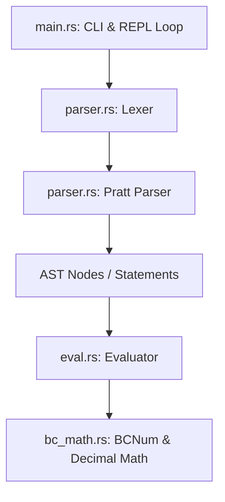

# AI Agent Design & Architecture: bc_clone

This document outlines the design decisions, technical architecture, and mathematical algorithms implemented by the AI coding agent (**Antigravity**) for the Rust-based `bc` calculator clone (`bc_clone`).

## System Architecture Overview

The system is designed with clean separation of concerns, divided into four key components:

### 1. Lexical Analysis and Parsing (`src/parser.rs`)
- **Lexer**: Tokenizes input character streams. Handles dynamic line number tracking, single and multi-line comments (`/* ... */`), string literals, escape characters, and backslash-newline continuation.
- **Parser**: A recursive descent parser utilizing Pratt parsing (precedence climbing) for algebraic expressions. 
  - Resolves operator precedence and associativity (e.g., right-associative exponentiation `^` and assignments).
  - Emits a clean AST consisting of `Stmt` (Statements) and `Expr` (Expressions).
  - Handles the GNU extension permitting `return` without enclosing parentheses.

### 2. Arbitrary-Precision Math (`src/bc_math.rs`)
- **`BCNum`**: The primary representation for user-facing numbers. Stores numbers as a `coeff: BigInt` coefficient and a `scale: usize` representing the number of fractional decimal digits.
  - Implements POSIX-compliant truncation/extension semantics for addition, subtraction, multiplication, division, modulo, and exponentiation.
  - Handles base conversion under arbitrary input bases (`ibase` in $[2, 16]$) and output bases (`obase` in $[2, \infty]$).
- **`Decimal`**: An internal, high-precision fixed-point helper type used specifically for computing transcendental functions. Pairwise operations are computed with an extra guard precision of 15 decimal digits.

### 3. AST Execution and Scoping (`src/eval.rs`)
- **Stack-based Scoping**: POSIX `bc` uses dynamic scoping. When a function is called, variables and arrays declared as `auto` are pushed onto a global stack map. References to variables resolve to the top-most element of the stack. When the function returns, the auto values are popped, restoring the caller's context.
- **WrappedStdout**: Custom output stream wrapping that formats number output lines to stay within 70 characters as mandated by POSIX, wrapping lines with a backslash-newline when necessary.

### 4. Entry Point & REPL Loop (`src/main.rs`)
- **Option Parsing**: Handled natively without external dependencies, adhering strictly to POSIX option-argument combinations (e.g., `-l` flag to load the math library).
- **Interactive REPL**: Employs an input accumulator that counts open braces and backslash-newlines to determine block completeness before evaluating. Bypasses signal registration under `#[cfg(test)]` to permit isolated, parallel tests.

---

## Math Library and Transcendental Approximations

All transcendental functions in `src/bc_math.rs` are calculated using `Decimal` fixed-point representations and Taylor series expansions with dynamic scaling/argument reduction.

### 1. Exponential function (`e(x)`)
To compute $e^x$ with high precision:
- **Argument Reduction**: We express $x$ as $x = n \ln(2) + r$, where $n$ is an integer and $r \in [0, \ln(2))$.
- **Taylor Series**: We calculate $e^r$ using its Taylor expansion:
  $$e^r = \sum_{k=0}^{\infty} \frac{r^k}{k!}$$
  Because $r < \ln(2) \approx 0.693$, this series converges extremely rapidly.
- **Reconstruction**: The final value is computed as $e^x = e^r \cdot 2^n$. Multiplication by $2^n$ is performed via binary exponentiation.

### 2. Natural Logarithm (`l(x)`)
To compute $\ln(x)$:
- **Argument Reduction**: We normalize the coefficient of the input $x$ to $x = m \cdot 2^k$, where $m \in [1/\sqrt{2}, \sqrt{2}]$.
- **Taylor Series**: We compute $\ln(m)$ using the rapid expansion:
  $$\ln\left(\frac{1+y}{1-y}\right) = 2 \sum_{n=0}^{\infty} \frac{y^{2n+1}}{2n+1}$$
  where $y = \frac{m-1}{m+1}$. Since $m \in [0.707, 1.414]$, $y \in [-0.171, 0.171]$, guaranteeing rapid convergence.
- **Reconstruction**: The result is reconstructed as $\ln(x) = \ln(m) + k \ln(2)$, where $\ln(2)$ is precomputed to the required precision.

### 3. Trigonometric Functions (`s(x)`, `c(x)`)
- **Argument Reduction**: Reduce $x$ modulo $2\pi$ to the range $[-\pi, \pi]$, then divide by a power of 2 ($2^p$) until the argument is small enough (typically $< 0.05$) to ensure fast convergence.
- **Taylor Series**: Compute $\sin$ and $\cos$ of the reduced argument $x'$:
  $$\sin(x') = \sum_{k=0}^{\infty} (-1)^k \frac{x'^{2k+1}}{(2k+1)!}, \quad \cos(x') = \sum_{k=0}^{\infty} (-1)^k \frac{x'^{2k}}{(2k)!}$$
- **Double-Angle Formula**: Double the result $p$ times using trigonometric identities:
  $$\sin(2\theta) = 2 \sin(\theta) \cos(\theta), \quad \cos(2\theta) = 2\cos^2(\theta) - 1$$

### 4. Arctangent (`a(x)`)
- **Argument Reduction**: If $|x| > 1$, we use $\arctan(x) = \frac{\pi}{2} - \arctan(1/x)$.
- **Taylor Series**: For small $x$, we use:
  $$\arctan(x) = \sum_{k=0}^{\infty} (-1)^k \frac{x^{2k+1}}{2k+1}$$

### 5. Bessel Function (`j(n, x)`)
- Computed using the infinite series definition for integer order $n$:
  $$J_n(x) = \sum_{m=0}^{\infty} \frac{(-1)^m (x/2)^{2m+n}}{m! (m+n)!}$$
  For negative orders, we apply the identity $J_{-n}(x) = (-1)^n J_n(x)$.

---

## Design Choices & Lessons Learned

### 1. Robust and Safe Error Recovery
To prevent the calculator from crashing on syntax errors or invalid runtime math (e.g., division by zero, square root of negative numbers), all execution and parsing paths are wrapped inside `std::panic::catch_unwind`. The application handles panics gracefully, prints clean error messages matching the expected style, and clears input state.

### 2. Immediate Exit on `quit`
POSIX `bc` terminates immediately upon reading the `quit` keyword, even if it resides on a line with other statements. By raising a targeted `"quit"` panic inside the parser, we bubble up the termination signal immediately. This avoids executing any prior statements on the same line and permits unit testing of the REPL exit logic without killing the test runner.
- **Silent Quit Hook**: To prevent Rust's default panic handler from printing an unsightly panic message/backtrace to `stderr` during `quit`, we registered a custom panic hook in `fn main()`. This hook intercepts `"quit"` panic payloads and exits silently, while letting other unexpected panics format tracebacks normally.

### 3. Preventing Parallel Test Conflicts
Signal handlers (such as `ctrlc::set_handler`) and panic hooks are global process-wide resources, and shared state like the `CTRL_C_PRESSED` atomic can cause race conditions during parallel test runs. 
- **Signal Guarding**: We isolated the signal handler registration behind a `#[cfg(not(test))]` guard, replacing it with a mock signal trigger in tests.
- **Test Serialization**: We introduced a `TEST_MUTEX` serial lock to synchronize unit tests in `src/main.rs` that access or modify process-wide states, preventing parallel runner threads from interfering with each other's execution.
